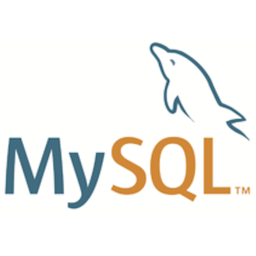

### Hi there, I'm [Manon][website] 👋

## I'm a Developper ...
- :computer: I'm currently working on ...
- :mortar_board: I'm currently learning everything
- :bulb: Fun fact : I love exploring caves on my own and discovering new places 🌱

### Connect with me:
[][website]
[][linkedin]

 

### Languages and Tools:
[][youtube]
[][youtube]
[][cssplaylist]
[][youtube]
[][youtube]
[][youtube]
[][youtube]
[][youtube]
[][youtube]
[][youtube]
[][youtube]

 
 

[website]: http://manonvessiot.epizy.com/
[linkedin]: https://www.linkedin.com/in/manon-vessiot-b5a054153
[youtube]: https://www.youtube.com